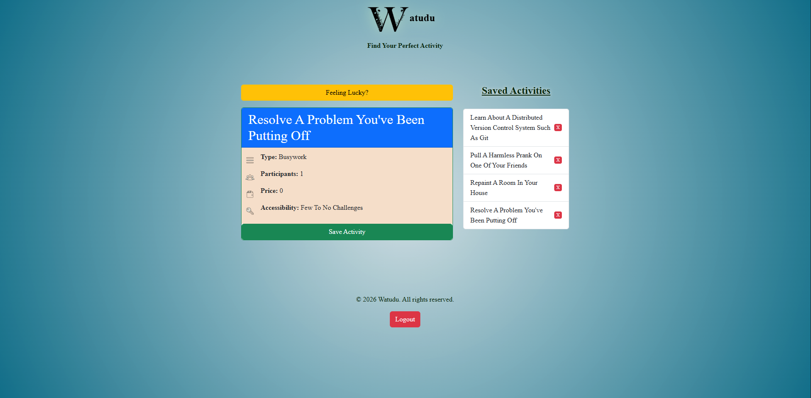

  ~Watudu~

---

Summary
- 
Watudu is a simple tool for when you're thinking of stuff to do but nothing is coming to mind. It will throw random activity suggestions to you and you can save your favorites in a list! No more wondering what is there to do.

Features
-
- A random activity generator at the click of button via API calling.
- A variety of activity types for different group sizes, price ranges as well as how easy they are to get into.
- A "Saved Activities" list to save your favorite activies or remove them if you change your mind.

Built with:
-
- HTML
- JavaScript
- CSS
- Bootstrap